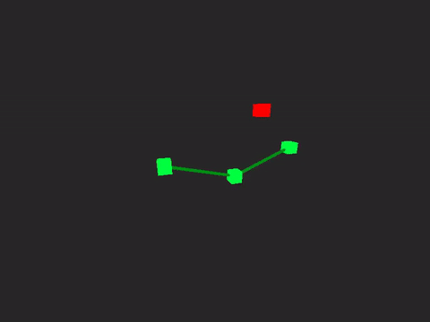

# cik
A C89 standard compliant, single header, nostdlib (no C Standard Library) Computational Inverse Kinematics (CIK).

<p align="center">
<a href="https://github.com/nickscha/cik"></a>
</p>

For more information please look at the "cik.h" file or take a look at the "examples" or "tests" folder.

> [!WARNING]
> THIS PROJECT IS A WORK IN PROGRESS! ANYTHING CAN CHANGE AT ANY MOMENT WITHOUT ANY NOTICE! USE THIS PROJECT AT YOUR OWN RISK!

<p align="center">
  <a href="https://github.com/nickscha/cik/releases">
    
  </a>
  <a href="https://github.com/nickscha/cik/releases">
    
  </a>
  <a href="https://opensource.org/licenses/MIT">
    
  </a>
  
  
</p>

## **Features**
- **C89 compliant** — portable and legacy-friendly  
- **Single-header API** — just include `cik.h`  
- **nostdlib** — no dependency on the C Standard Library  
- **Minimal binary size** — optimized for small executables  
- **Cross-platform** — Windows, Linux, MacOs 
- **Strict compilation** — built with aggressive warnings & safety checks  

## Quick Start

Download or clone cik.h and include it in your project.

```C
#include "cik.h" /* Computational Inverse Kinematics */

int main() {

    /* ---- Arm Setup ---- */
    int joint_count = 3;
    v3 positions[CIK_MAX_JOINTS];
    v3 hinge_axes[CIK_MAX_JOINTS];
    int hinge_types[CIK_MAX_JOINTS];
    float max_angles[CIK_MAX_JOINTS];
    float hinge_min[CIK_MAX_JOINTS];
    float hinge_max[CIK_MAX_JOINTS];
    
    v3 target = cik_v3(2.0f, 1.0f, 0.0f);
    float tolerance = 1e-3f;
    int max_iterations = 16;

    /* Stores the result of the fabrik solver */
    int reached;

    /* Initial positions (straight arm) */
    positions[0] = cik_v3(0.0f, 0.0f, 0.0f);
    positions[1] = cik_v3(1.5f, 0.1f, 0.0f);
    positions[2] = cik_v3(3.0f, 0.0f, 0.0f);

    /* Joint constraints (allow full freedom) */
    max_angles[0] = CIK_PI;
    max_angles[1] = CIK_PI;
    hinge_types[0] = 0;                       /* spherical joint */
    hinge_types[1] = 0;                       /* set to 1 for hinge joint */
    hinge_axes[1] = cik_v3(0.0f, 0.0f, 1.0f); /* not used when hinge_type = 0, Z hinge */
    hinge_min[1] = -CIK_PI;                   /* not used when hinge_type = 0, allow full swing -180° */
    hinge_max[1] = CIK_PI;                    /* not used when hinge_type = 0, allow full swing +180° */


    /* Run the FABRIK solver. Return code: 
    * 0 = converged within tolerance
    * 1 = max_iter reached (did not converge)
    * 2 = invalid input (n < 2 or exceeds CIK_MAX_JOINTS or degenerate lengths)
    * 3 = target unreachable, clamped at max reach
    */
    reached = cik_fabrik_solve(
        positions,
        joint_count,
        target,
        max_angles,
        hinge_types,
        hinge_axes,
        hinge_min,
        hinge_max,
        tolerance,     /* tolerance */
        max_iterations /* max iterations */
    ); 
    
    return 0;
}
```

## Run Example: nostdlib, freestsanding

In this repo you will find the "examples/cik_win32_nostdlib.c" with the corresponding "build.bat" file which
creates an executable only linked to "kernel32" and is not using the C standard library and executes the program afterwards.

## "nostdlib" Motivation & Purpose

nostdlib is a lightweight, minimalistic approach to C development that removes dependencies on the standard library. The motivation behind this project is to provide developers with greater control over their code by eliminating unnecessary overhead, reducing binary size, and enabling deployment in resource-constrained environments.

Many modern development environments rely heavily on the standard library, which, while convenient, introduces unnecessary bloat, security risks, and unpredictable dependencies. nostdlib aims to give developers fine-grained control over memory management, execution flow, and system calls by working directly with the underlying platform.

### Benefits

#### Minimal overhead
By removing the standard library, nostdlib significantly reduces runtime overhead, allowing for faster execution and smaller binary sizes.

#### Increased security
Standard libraries often include unnecessary functions that increase the attack surface of an application. nostdlib mitigates security risks by removing unused and potentially vulnerable components.

#### Reduced binary size
Without linking to the standard library, binaries are smaller, making them ideal for embedded systems, bootloaders, and operating systems where storage is limited.

#### Enhanced performance
Direct control over system calls and memory management leads to performance gains by eliminating abstraction layers imposed by standard libraries.

#### Better portability
By relying only on fundamental system interfaces, nostdlib allows for easier porting across different platforms without worrying about standard library availability.
